# Probabilistic Colision Cone Control Barrier Function (PCC-CBF)
Implementation of Robust Colision Cone Control Barrier Function for holonomic mobile robot, with kinematic modelled with equations:

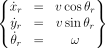


Where $v$ and $\omega$ are controll inputs.
<!-- ==================================================================================== -->
## Base Controller
Base controller trajectories:

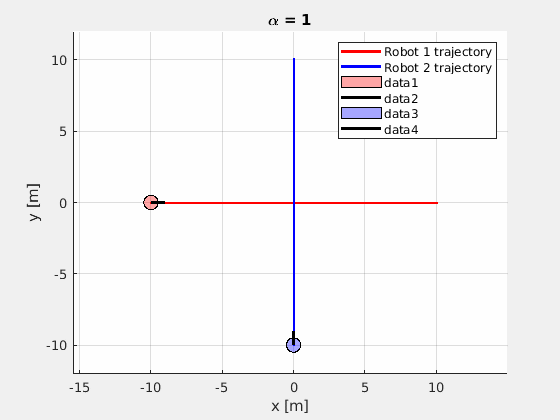

Distance between robots:

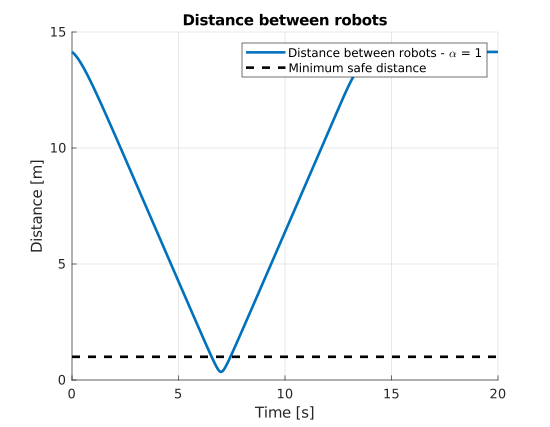

<!-- ==================================================================================== -->
## Control Barrier Functions
<!-- ------------------------------------------------------------------------------------ -->
### Colision Cone Conrtol Barrier Function (C3BF)
Colision Cone Control Barrier Function is defined in following way:

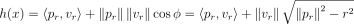

Where $p_r$ and $v_r$ are relative position and velocity of robot and obstacle - as it is presented in figure below.

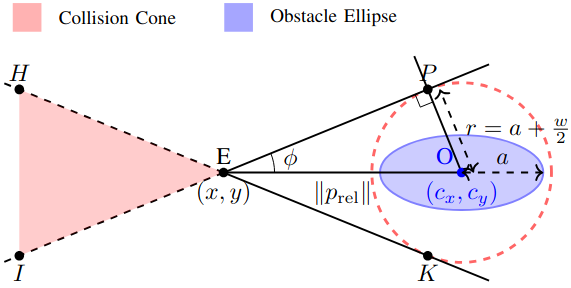

And are defined in following way:

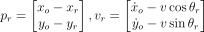
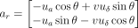

To stay in safe space control needs to met following condition:

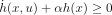

Where derivative is defined as:

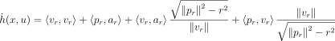

Example trajectory of two robots in colision course is presented below:

Distance between robots (each robot has 0.5 meter radius):

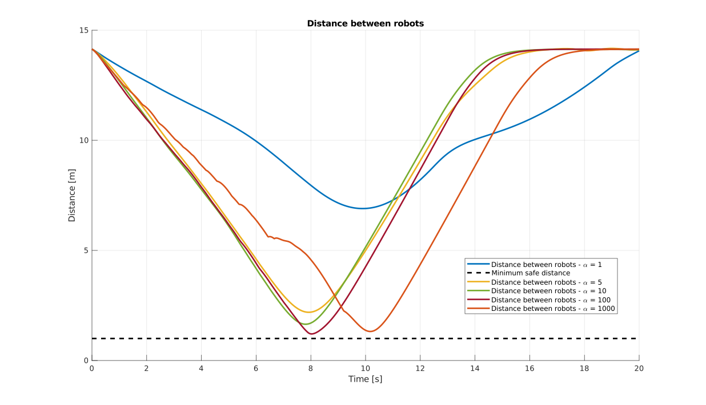

<!-- ------------------------------------------------------------------------------------ -->
### Probabilistic Colision Cone Conrtol Barrier Function (PC3BF)
Assume that $p_r \sim (\hat{p}_{r}, \Sigma_{p})$ and $v_r \sim (\hat{v}_{r}, \Sigma_{v})$ then uncertain Control Barrier Function has form:

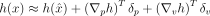

Where $\delta_{p} \sim (0, \Sigma_{p})$ and $\delta_{v} \sim (0, \Sigma_{v})$.

And derivative has form:

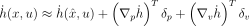

This leads to inequality condition:

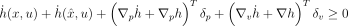

Where:

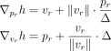

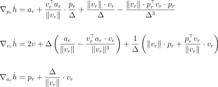

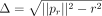

Taking it simply it is $c_{h}(x,u) \sim (\mu_{h}, \sigma_{h}^{2})$.

So finally w need to check if random variable $c_{h}(x,u) \geq 0$ with some required probbaility $1-\delta$.
This condition can be written as:

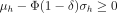


Example trajectory of two robots in colision course, for different $\alpha$
values, is presented below:
#### Unicycle model

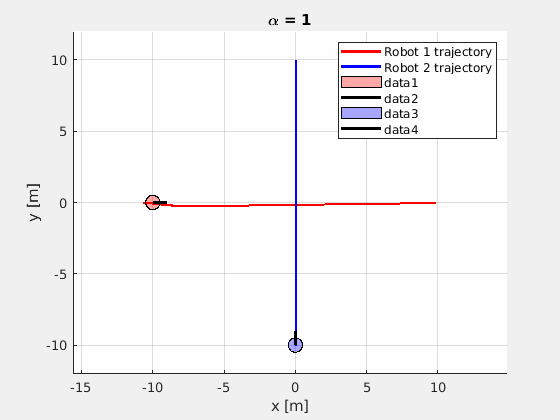

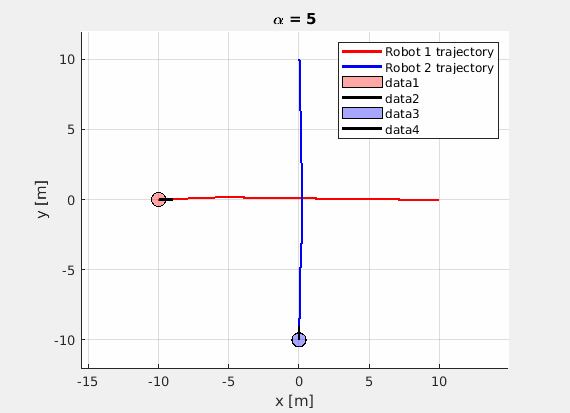

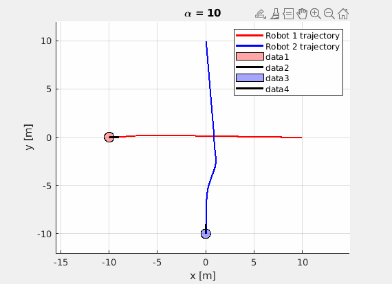

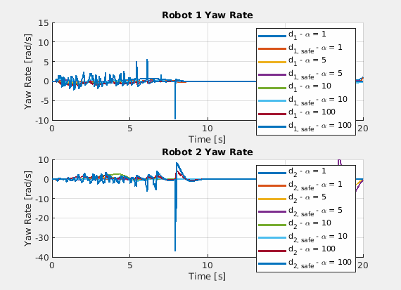

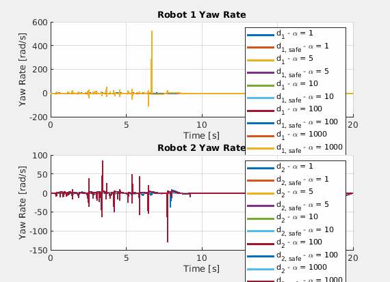

#### Bicycle model

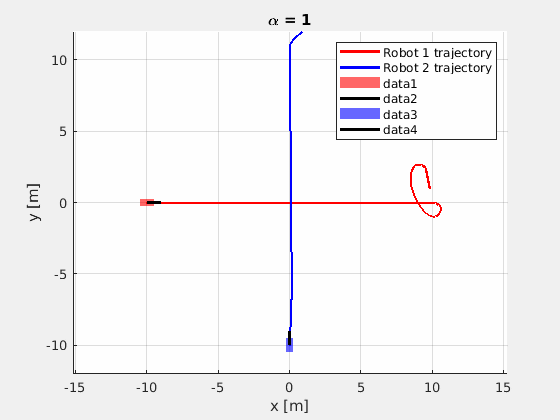

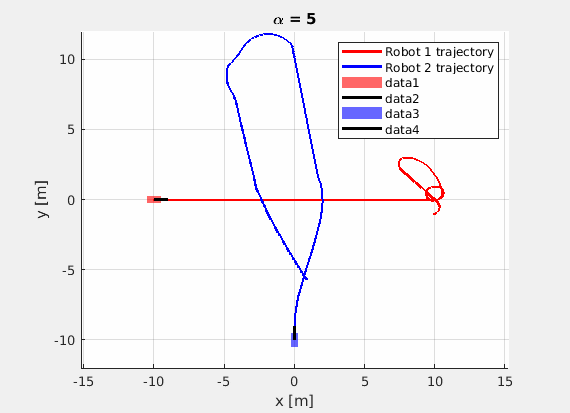

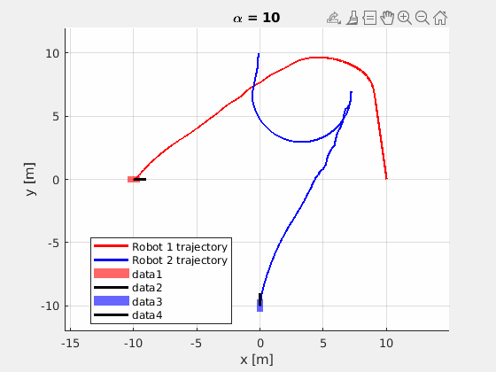


## How to run?
### Docker
Build image:
```bash
docker build -t ros2_dev:humble .
```

Run docker container:
```bash
xhost +local:docker

docker run -it \
    --name ros2-rc3bf \
    --env="DISPLAY" \
    --env="QT_X11_NO_MITSHM=1" \
    --volume="/tmp/.X11-unix:/tmp/.X11-unix:rw" \
    --volume="${HOME}/.Xauthority:/root/.Xauthority:rw" \
    --env="XAUTHORITY=/root/.Xauthority" \
    --volume="/yout/paths/robust_c3cbf:/dev/ros_ws:rw" \
    --net=host \
    ros:humble \
    bash
```

### Build ROS2 Node
```bash
colcon build
source install/setup.bash
```

### Run
This command runs two robot nodes on collision trajectories.
```bash
ros2 launch rc3bf two_robots_straight_line.launch.py
```