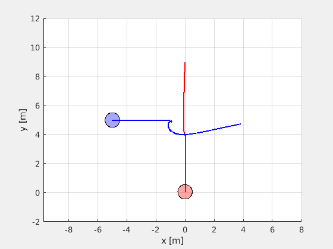

# Robust Colision Cone Control Barrier Function (RC3BF)
Implementation of Robust Colision Cone Control Barrier Function for holonomic mobile robot, with kinematic modelled with equations:

Where $v$ and $\omega$ are controll inputs.

## Colision Cone Conrtol Barrier Function (C3BF)
Colision Cone Control Barrier Function is defined in following way:

Where $p_r$ and $v_r$ are relative position and velocity of robot and obstacle - as it is presented in figure below.

And are defined in following way:

To stay in safe space control needs to met following condition:

Where derivative is defined as:

Example trajectory of two robots in colision course is presented below:

